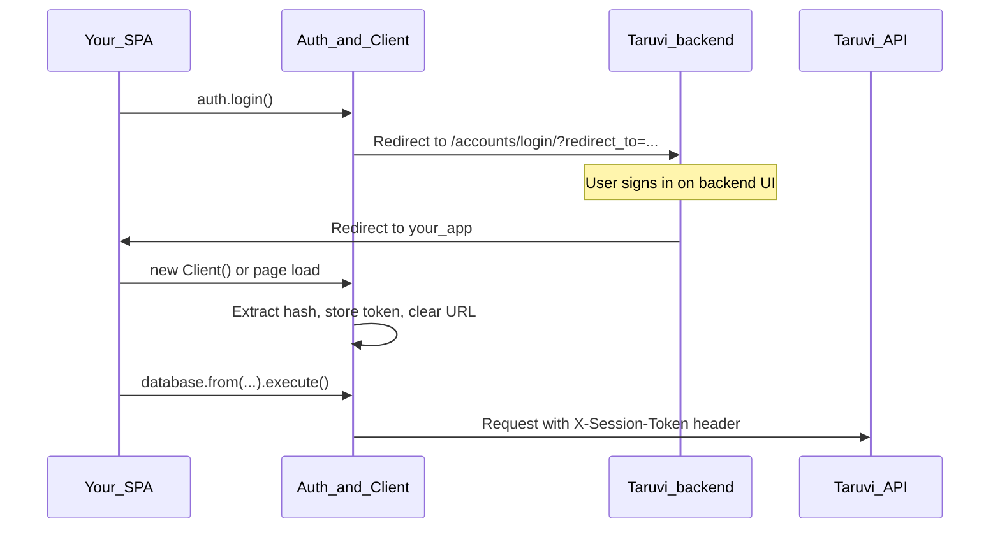

# Introduction

## What is the Taruvi SDK?

The Taruvi SDK is a TypeScript library that provides developers with a **consistent way to query the Taruvi backend**. Instead of hand-crafting HTTP URLs, headers, and query strings for each service, you use typed client classes that share the same configuration, authentication, and error handling.

The SDK covers:

- **App data** — CRUD, filters, pagination, graph traversal (`Database`)
- **File storage** — upload, download, list, delete (`Storage`)
- **Authentication** — browser login/signup/logout with session tokens (`Auth`)
- **Users, settings, secrets, functions, analytics, policy, and app metadata** — dedicated clients for each domain

All services receive a single root [`Client`](../src/client.ts) instance so credentials and base URLs stay in one place.

## Installation

```bash
# Stable release (main branch)
npm install @taruvi/sdk

# Experimental release (beta branch)
npm install @taruvi/sdk@beta
```

The **`main`** branch ships stable versions; **`beta`** ships experimental ones. Publishing is automated when `package.json` version changes and is pushed — see [Releases and branches](08-releases-and-branches.md).

**Peer dependencies:** `axios` (>=1), `typescript` (>=5.7), and optionally `@types/node` for server-side use.

## Initialize the Client

Create one `Client` per application context (or per request on the server). Required config fields:

| Field | Description |
|-------|-------------|
| `apiKey` | Site API key — required; identifies which site the client belongs to (see [apiKey](#apikey) below) |
| `appSlug` | App slug — scopes requests to your app |
| `apiUrl` | Base API URL (e.g. `https://taruvi-site.taruvi.cloud`) |
| `deskUrl` | Optional — login/logout page base URL (defaults to `apiUrl`) |
| `token` | Optional — pre-existing session token (useful on the server) |

```typescript
import { Client } from '@taruvi/sdk'

const client = new Client({
  apiKey: 'your-site-api-key',
  appSlug: 'your-app-slug',
  apiUrl: 'https://taruvi-site.taruvi.cloud',
  deskUrl: 'https://desk.example.com', // optional
})
```

### Authentication flow (Web UI Flow)

The SDK **does not implement login itself**. End-user authentication is handled entirely by the **Taruvi backend** (hosted login, signup, and logout pages). The `Auth` client only starts redirects; the backend validates credentials, creates the session, and sends the user back to your app with a token.

**What the SDK does:**

- Redirect the browser to backend auth URLs (`login`, `signup`, `logout`)
- Store the `session_token` when the user returns
- Attach `X-Session-Token` on every API request via `HttpClient`

**What the backend does:**

- Render login/signup forms and validate username/password (or SSO)
- Issue a session and redirect to your `redirect_to` URL with `#session_token=...` in the hash



#### Step by step (login)

1. **Your app** calls `new Auth(client).login()` (optional `callbackUrl`; defaults to current page).
2. **SDK** sets `window.location` to `{deskUrl}/accounts/login/?redirect_to={callback}` (`deskUrl` defaults to `apiUrl`). It may save `auth_state` in `sessionStorage` for the return path.
3. **Backend** shows the login page, authenticates the user, and redirects back to your `redirect_to` URL with `#session_token=...` in the hash.
4. **SDK** (`Client` constructor on load): reads the hash, stores the token in `localStorage`, removes the hash from the address bar (no full page reload).
5. **Your app** calls `auth.isUserAuthenticated()` or `auth.getCurrentUser()` and uses other clients (`Database`, `Storage`, …) as usual — `HttpClient` sends the session token automatically.

Signup follows the same pattern via `auth.signup()`, redirecting to `{apiUrl}/accounts/signup/?redirect_to=...`.

Logout: `auth.logout()` POSTs to `api/v4/users/logout`, clears the local token, then redirects to `{deskUrl}/accounts/logout/?redirect_to=...` so the backend can end the server session.

#### Automatic session token (browser)

After the backend redirect, the URL may contain `#session_token=xxx`. On `Client` initialization the SDK automatically:

1. Extracts `session_token` from the hash
2. Stores it via the internal token client (`localStorage` in the browser)
3. Clears the hash from the URL without reloading

No manual token parsing is required in typical SPA flows. Create the `Client` once when your app boots (or reload after redirect) so extraction runs.

### `apiKey`

`apiKey` is **required** when constructing `Client`. It is stored in configuration and validated at startup. **Authenticated API requests** use the **session token** (`X-Session-Token` header), not the apiKey as a request header in the current SDK implementation.

Always pass the correct site apiKey from your Taruvi site settings. If your deployment also relies on cookies, `HttpClient` uses `withCredentials: true` so the browser can send them when applicable.

### Server-side token

Pass a session token in config when running outside the browser:

```typescript
const client = new Client({
  apiKey: process.env.TARUVI_API_KEY!,
  appSlug: 'my-app',
  apiUrl: process.env.TARUVI_API_URL!,
  token: process.env.TARUVI_SESSION_TOKEN,
})
```

## Dependency injection pattern

Service classes are **not singletons**. Instantiate each service with the shared `Client`:

```typescript
import {
  Client,
  Database,
  Storage,
  Auth,
  User,
  Functions,
  Analytics,
  Settings,
  Secrets,
  Policy,
  App,
} from '@taruvi/sdk'

const client = new Client({ apiKey, appSlug, apiUrl })

// One instance per service — pass the same client everywhere
const database = new Database(client)
const storage = new Storage(client)
const auth = new Auth(client)
const users = new User(client)
```

### React example

```typescript
// App.tsx — create client once
const taruviClient = new Client({ apiKey, appSlug, apiUrl })

// Pass to routes or context
<Route path="/dashboard" element={<Dashboard taruviClient={taruviClient} />} />

// Dashboard.tsx — construct services from the client
function Dashboard({ taruviClient }: { taruviClient: Client }) {
  const db = new Database(taruviClient)

  useEffect(() => {
    db.from('accounts').filters('status', 'eq', 'active').execute().then(/* ... */)
  }, [])
}
```

You can also wrap services in your own hooks or context providers; the SDK does not enforce a specific pattern.

## Response shape

Most data APIs return a wrapped response:

```typescript
interface TaruviResponse<T> {
  status: 'success' | 'error'
  message: string
  data: T
  total?: number
  pagination?: PaginationInfo
}
```

Builder terminals like `Database.execute()` return `Promise<TaruviResponse<T | T[]>>`. Direct clients (e.g. `User.list()`) return their own typed responses — see [API reference](05-api-reference.md).

## Browser vs Node

| Feature | Browser | Node / server |
|---------|---------|----------------|
| `Auth.login()` / `signup()` / `logout()` | Yes (redirects) | No — pass `token` in config |
| Session token storage | `localStorage` | In-memory via config `token` |
| `Storage.upload()` | Yes (`File`, `FormData`) | Requires `File` / `FormData` (Node 18+ or polyfill) |
| URL hash token extraction | Automatic on `Client` init | Skipped |

See [Troubleshooting & advanced topics](07-advanced-topics.md) for CORS, typing, and packaging notes.

## Next steps

- Auth client details and URLs: [Clients — Auth](04-clients.md#auth)
- Understand why queries use an **immutable builder**: [Builder pattern](02-builder-pattern.md)
- See how the SDK is structured internally: [Architecture](03-architecture.md)
- Pick the right client for your task: [Clients](04-clients.md)
- Copy working patterns: [Examples](06-examples.md)
- Advanced typing, filters, troubleshooting: [Advanced topics](07-advanced-topics.md)
