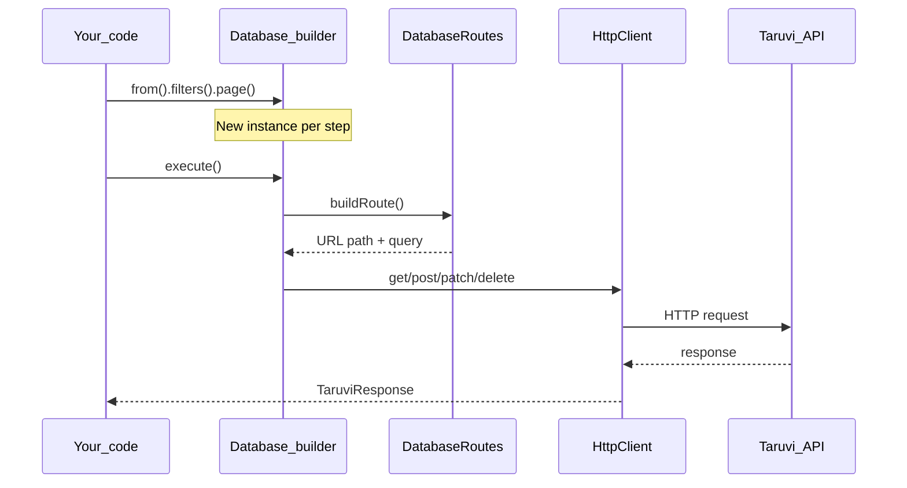

# Builder pattern

Several SDK services use an **immutable fluent builder**: you chain methods to describe a request, then call a terminal method to run it. No HTTP request is sent until you reach that terminal.

**Builder services:** `Database`, `Storage`, `App`, and `Secrets.get()`

**Direct services (no builder):** `Auth`, `User`, `Functions`, `Analytics`, `Settings`, `Policy`, plus `Secrets.list()`

## Why a new instance on every chain step

Each builder holds private state for a single request:

- **URL segments** — table name, bucket, record ID, paths
- **HTTP operation** — GET, POST, PATCH, DELETE
- **Request body** — create/update payloads
- **Query parameters** — filters, pagination, sorting, graph options

If the builder were **mutable** (reusing one object and updating fields in place), a second chain from the same starting point would overwrite the first:

```typescript
// Hypothetical MUTABLE builder (NOT how this SDK works)
const base = db.from('accounts')
base.filters('status', 'eq', 'active')  // mutates base
base.page(2)                              // overwrites filters on same object
// Result: broken — only page=2, lost status filter
```

The Taruvi SDK avoids this by returning a **new instance** on every chain method. Each instance copies prior state forward with object spread, then applies the new change:

```typescript
// Actual IMMUTABLE builder
filters(field, operator, value) {
  return new Database(this.client, { ...this.urlParams }, undefined, undefined, {
    ...this.queryParams,
    [filterKey]: filterValue
  }, { ...this.graphParams }, this.isEdges)
}
```

This means:

1. **Multiple independent queries** — Start from the same `from('accounts')` and branch into different filters, pages, or sorts without cross-contamination.
2. **No stale URLs** — Each chain captures its own snapshot of params; executing one chain never changes another.
3. **Safe reuse** — Store a `base` query and derive variants (`activeUsers`, `page2`, `sortedByName`) as siblings, not mutations.

### Immutability in practice

```typescript
const base = new Database(client).from('accounts')

const active = base.filters('status', 'eq', 'active')
const sorted = base.sort('name', 'asc')

await active.execute()  // URL contains status=active, no ordering
await sorted.execute()  // URL contains ordering=name, no status filter
```

The SDK tests this behavior explicitly in `tests/unit/edge-cases/robustness.test.ts` under **Builder immutability**.

### Accumulating methods

Most builder methods **replace** the corresponding query param (e.g. `.page(2)` overwrites any prior page value). However, the following methods **accumulate** when chained — each call appends to the existing value with a comma separator:

| Method | Query param | Example |
|--------|-------------|---------|
| `sort` | `ordering` | `.sort('name', 'asc').sort('created_at', 'desc')` → `ordering=name,-created_at` |
| `aggregate` | `_aggregate` | `.aggregate('sum(salary)').aggregate('avg(age)')` → `_aggregate=sum(salary),avg(age)` |
| `groupBy` | `_group_by` | `.groupBy('dept').groupBy('role')` → `_group_by=dept,role` |
| `having` | `_having` | `.having('count__gt=5').having('sum_salary__gte=1000')` → `_having=count__gt=5,sum_salary__gte=1000` |
| `allowedActions` | `allowed_actions` | `.allowedActions(['read']).allowedActions(['write'])` → `allowed_actions=read,write` |

You can still pass everything in a single call (e.g. `sort([{field:'name'},{field:'created_at',order:'desc'}])`); accumulation simply makes incremental chaining safe.

## How the builder works

### 1. Configure (no network)

Chain methods only update internal state and return a new builder instance:

```
new Database(client)
  → .from('accounts')           // sets table
  → .filters('status', 'eq', 'active')
  → .sort('created_at', 'desc')
  → .page(1).pageSize(20)
```

Until you call a terminal, **nothing is sent over the wire**.

### 2. Execute (HTTP)

Terminal methods build the URL, call `HttpClient`, and return the response:

| Terminal | Service | Behavior |
|----------|---------|----------|
| `.execute()` | Database, Storage, App, Secrets | Runs the configured request |
| `.first()` | Database | `.execute()` then returns first row or `null` |
| `.count()` | Database | `.execute()` then returns `total` or array length |

### 3. URL construction

Internally, `execute()`:

1. Validates required scope (e.g. `.from(table)` was called)
2. Builds the path via route helpers in `lib-internal/routes/` (e.g. `DatabaseRoutes`)
3. Appends query string from filters and graph params
4. Dispatches to `client.httpClient` with the correct method and body



### State carried by `Database` (canonical example)

| State | Set by | Used for |
|-------|--------|----------|
| `urlParams` | `from`, `get`, `edges` | Table name, record ID |
| `queryParams` | `filters`, `sort`, `page`, `populate`, … | Query string |
| `graphParams` | `include`, `depth`, `format`, `types` | Graph traversal |
| `operation` | `get`, `create`, `update`, `delete`, … | HTTP method |
| `body` | `create`, `update`, `delete` (edges) | Request payload |
| `isEdges` | `edges()` | Route to `table_edges` |
| `isUpsert` | `upsert()` | Append upsert path segment |

`Storage`, `App`, and `Secrets` follow the same idea with their own param objects.

## Builder vs direct clients

| Pattern | When to use |
|---------|-------------|
| **Builder** | Request has many optional query params or path segments; you want fluent chaining |
| **Direct** | Single endpoint, few parameters — call the method and await the result |

Example — builder:

```typescript
await new Database(client)
  .from('orders')
  .filters('status', 'eq', 'pending')
  .populate(['customer'])
  .execute()
```

Example — direct:

```typescript
await new User(client).getUser('jane.doe')
```

## Anti-pattern: assuming mutation

```typescript
// Wrong mental model
const query = new Database(client).from('accounts')
query.filters('status', 'eq', 'active')
query.page(2)  // If this mutated query, filters might be lost
await query.execute()
```

```typescript
// Correct — each step returns a new instance; keep the one you need
const query = new Database(client)
  .from('accounts')
  .filters('status', 'eq', 'active')
  .page(2)

await query.execute()
```

Or branch from a shared base (see [Examples — immutable base](06-examples.md#immutable-base-queries)).

## Same pattern on other services

| Service | Entry | Terminal |
|---------|-------|----------|
| `Database` | `.from(table)` | `.execute()`, `.first()`, `.count()` |
| `Storage` | `.from(bucket)` | `.execute()` |
| `App` | `.roles()` or `.settings()` | `.execute()` |
| `Secrets` | `.get(key)` | `.execute()` |

## Next steps

- [Clients overview](04-clients.md) — what each service does
- [API reference](05-api-reference.md) — every chain method listed
- [Examples](06-examples.md) — copy-paste chaining patterns
