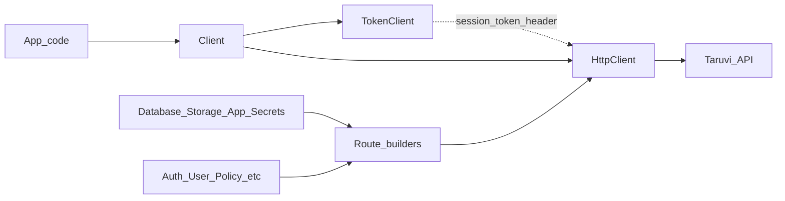

# Architecture

This page explains how the SDK is organized, how a request flows from your code to the Taruvi API, and what you should import as an application developer.

## High-level request flow



1. You create a [`Client`](../src/client.ts) with `TaruviConfig`.
2. `Client` constructs internal `TokenClient` and `HttpClient`.
3. Public service classes (`Database`, `Auth`, …) use route helpers to build URLs and call `client.httpClient`.
4. `HttpClient` attaches the session token (`X-Session-Token`), sends requests with `withCredentials: true` (cookies when applicable), and maps HTTP errors to typed SDK errors.

### Authentication headers

| Mechanism | Used by SDK today |
|-----------|-------------------|
| `X-Session-Token` | Yes — session token from login or `Client` config `token` |
| `apiKey` in config | Required on `Client`; stored in `TaruviConfig` and validated at construction. **Not** sent as an HTTP header by the current `HttpClient`. Identify your site when creating the client; use session token for authenticated API calls. |
| Cookies | Axios `withCredentials: true` — backend may use cookies alongside the session header |

## `src/lib` vs `src/lib-internal`

| Layer | Path | Audience | Responsibility |
|-------|------|----------|----------------|
| **Public** | [`src/lib/`](../src/lib/) | Application developers | Domain-facing APIs: auth, users, database, storage, etc. |
| **Internal** | [`src/lib-internal/`](../src/lib-internal/) | SDK maintainers | HTTP transport, token storage, URL route builders, error mapping |

### Public modules (`src/lib/`)

Each feature is a folder with a `*Client.ts` and `types.ts`:

| Module | Client class |
|--------|--------------|
| `auth/` | `Auth` |
| `users/` | `User` |
| `database/` | `Database` |
| `storage/` | `Storage` |
| `functions/` | `Functions` |
| `analytics/` | `Analytics` |
| `settings/` | `Settings` |
| `secrets/` | `Secrets` |
| `policy/` | `Policy` |
| `app/` | `App` |

Import these from `@taruvi/sdk` — see [`src/index.ts`](../src/index.ts).

### Internal modules (`src/lib-internal/`)

| Module | Purpose |
|--------|---------|
| [`http/HttpClient.ts`](../src/lib-internal/http/HttpClient.ts) | Axios wrapper; adds auth header; clears tokens on 401; maps errors |
| [`token/TokenClient.ts`](../src/lib-internal/token/TokenClient.ts) | Session token in `localStorage` (browser) or memory (server) |
| [`routes/*.ts`](../src/lib-internal/routes/) | Pure functions that build URL paths per service |
| [`errors/`](../src/lib-internal/errors/) | `TaruviError`, `AuthError`, `NotFoundError`, etc. + `createErrorFromResponse` |

You typically **do not** import route builders or `HttpClient` in application code. Service clients encapsulate them.

### Endpoint paths and `baseURL` (maintainers)

[`HttpClient`](../src/lib-internal/http/HttpClient.ts) prepends a `/` to the endpoint on every request (for example `` `/${endpoint}` `` in `get`, `post`, `patch`, etc.).

If the endpoint string already starts with `/`, the final path becomes a **double slash** — e.g. endpoint `/api/v4/users/logout` becomes `//api/v4/users/logout`. When Axios sees a path starting with `//`, it treats it as a **protocol-relative URL**, which **bypasses `baseURL`**. The request may leave your configured `apiUrl` and fail or hit the wrong host.

**When adding or reviewing SDK routes and internal HTTP calls:** pass endpoints **without** a leading slash (e.g. `api/v4/users/logout`, not `/api/v4/users/logout`). `Auth.logout()` follows this pattern when calling `httpClient.post('api/v4/users/logout', {})`.

### What is exported anyway?

[`src/index.ts`](../src/index.ts) exports:

- `Client` and all public service classes
- Error classes and `ErrorCode` (from `lib-internal/errors`)
- `AuthTokens` type (from internal token client)
- Shared and per-module TypeScript types

`Client.httpClient` and `Client.tokenClient` are marked `@internal` — for SDK/tests only.

## Root `Client`

[`src/client.ts`](../src/client.ts) is the single entry point for configuration:

- Validates `apiKey` and `apiUrl`
- Wires `TokenClient` → `HttpClient`
- Extracts `session_token` from URL hash on OAuth callback (browser only)
- Exposes `getConfig()` as a read-only copy

Service classes take `Client` in their constructor and read config via `client.getConfig()`.

## Route builders

Route modules encode URL structure so clients stay readable. Example — database:

```
api/apps/{appSlug}/datatables/{tableName}/[{recordId}/][upsert/]?{query}
```

`Database.buildRoute()` combines `DatabaseRoutes` segments with `buildQueryString()` from [`src/utils/utils.ts`](../src/utils/utils.ts).

Similar modules exist for Storage, User, Functions, Analytics, Policy, Secrets, App, and Settings.

## Error handling

Failed HTTP responses are converted to typed errors (`AuthError`, `NotFoundError`, `ValidationError`, …) via `createErrorFromResponse`. Import these from `@taruvi/sdk` to handle failures in `try/catch`:

```typescript
import { AuthError, NotFoundError } from '@taruvi/sdk'

try {
  await new Database(client).from('accounts').get('missing').execute()
} catch (e) {
  if (e instanceof NotFoundError) { /* ... */ }
}
```

## Utilities

[`src/utils/`](../src/utils/) holds shared helpers:

- `buildQueryString` — serializes filter objects to query strings
- `enums.ts` — `MimeTypeCategory`, `Visibility`, etc.

## Backend contract reference

For how SDK query params map to backend behavior (PostgREST-style data API, Cerbos policy, etc.), see [SDK_DESIGN_CONTEXT.md](../SDK_DESIGN_CONTEXT.md).

**Note:** That document describes the broader platform (including JWT Bearer in some flows). **This SDK** uses the **Web UI Flow** and **`X-Session-Token`** for app API calls — see [Introduction — Authentication flow](01-introduction.md#authentication-flow-web-ui-flow). Prefer the guides in `docs/` for SDK usage.

## Next steps

- [Clients](04-clients.md) — when to use each public service
- [API reference](05-api-reference.md) — full method list
