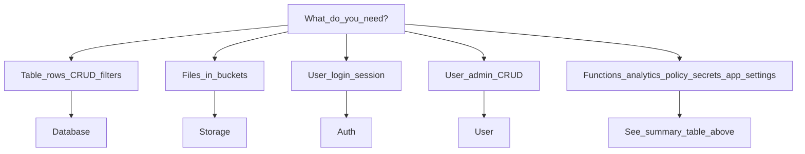

# Clients overview

Every service class receives a shared [`Client`](../src/client.ts) instance. This page summarizes **what each client does**, whether it uses the **builder pattern**, and **when to use it**.

## Summary table

| Client | Pattern | Primary use |
|--------|---------|-------------|
| `Client` | Root config | API key, app slug, base URL, token wiring |
| `Database` | Builder | App table CRUD, filters, pagination, graph/edges |
| `Storage` | Builder | Bucket files: list, upload, download, delete, metadata |
| `Auth` | Direct | Browser login/signup/logout; session token; current user |
| `User` | Direct | User admin: CRUD, roles, preferences |
| `Functions` | Direct | Invoke serverless functions |
| `Analytics` | Direct | Run predefined analytics queries |
| `Settings` | Direct | Site metadata and user attribute schema |
| `Secrets` | Mixed | `get()` builder; `list()` direct batch |
| `Policy` | Direct | Cerbos-style permission checks |
| `App` | Builder | App roles and settings endpoints |

---

## `Client`

**When:** Always — create one per app context (or per server request).

Holds `apiKey`, `appSlug`, `apiUrl`, optional `deskUrl` and `token`. Constructs HTTP and token handling. Extracts `session_token` from URL hash after login redirect in the browser.

```typescript
const client = new Client({ apiKey, appSlug, apiUrl })
```

---

## `Database`

**Pattern:** Immutable builder → `.execute()` / `.first()` / `.count()`

**When:** Reading or writing rows in app data tables; filtering, sorting, paginating; eager-loading relations; hierarchical graph queries and edge management.

**Entry:** `.from('table_name')`

**Typical flows:**

- List: `.from('accounts').filters(...).sort(...).page(1).execute()`
- Single row: `.from('accounts').get('id').execute()` or `.first()`
- Create: `.from('accounts').create({ ... }).execute()`
- Graph: `.from('employees').get('1').include('descendants').depth(3).execute()`

See [Builder pattern](02-builder-pattern.md) and [Examples](06-examples.md).

---

## `Storage`

**Pattern:** Immutable builder → `.execute()`

**When:** Working with file buckets — list objects, upload, download blobs, update metadata, bulk delete.

**Entry:** `.from('bucket_name')`

**Typical flows:**

- List: `.from('documents').filter({ mimetype: 'application/pdf' }).execute()`
- Download: `.from('documents').download('path/file.pdf').execute()` → `Blob`
- Upload: `.from('documents').upload({ files, paths, metadatas }).execute()`
- Get URL: `.from('documents').getUrl('path/file.pdf')` → full API URL string (no HTTP request)

List filters (`mimetype`, `visibility`, date/size ranges, etc.) — see [Advanced topics — Storage filters](07-advanced-topics.md#storage-filters).

---

## `Auth`

**Pattern:** Direct methods (browser-oriented)

**When:** End-user authentication in a SPA — start login/signup/logout, check session, fetch current user profile.

### Backend-handled login (Web UI Flow)

The SDK does **not** collect passwords or issue sessions. The **Taruvi backend** owns the login UI and credential validation. `Auth` only redirects the browser; after a successful login the backend redirects back with `#session_token=...` and the SDK stores it.

See [Introduction — Authentication flow](01-introduction.md#authentication-flow-web-ui-flow) for the full sequence diagram and steps.

| Step | Who | What happens |
|------|-----|----------------|
| 1 | Your app | `auth.login(callbackUrl?)` |
| 2 | SDK | Redirect to backend login (`deskUrl` or `apiUrl` + `/accounts/login/`) |
| 3 | Backend | User signs in on hosted page |
| 4 | Backend | Redirect to your app with `#session_token=...` |
| 5 | SDK (`Client`) | Extract token, persist, clear hash |
| 6 | Your app | API calls include `X-Session-Token` |

**URL bases:**

- **Login / logout** — `deskUrl` if set, otherwise `apiUrl`
- **Signup** — always `apiUrl` (`/accounts/signup/`)

### Methods

| Method | Purpose |
|--------|---------|
| `login(callbackUrl?)` | Redirect to backend login page |
| `signup(callbackUrl?)` | Redirect to backend signup page |
| `logout(callbackUrl?)` | POST `api/v4/users/logout`; clear local token; redirect to backend logout |
| `isUserAuthenticated()` | Whether a session token exists locally |
| `getSessionToken()` | Raw session token string |
| `getCurrentUser()` | Fetch current user from API (requires token) |

Uses **session token** authentication (`X-Session-Token`), not JWT refresh flows. On **401** (unauthorized), `HttpClient` clears the stored token. **403** (forbidden) means you are authenticated but lack permission — the token is kept.

**Server / API-only apps:** pass `token` in `Client` config; do not call `login()` (browser-only).

---

## `User`

**Pattern:** Direct async methods

**When:** Admin or backend operations on users — not the same as “current logged-in user” (`Auth.getCurrentUser()`).

- Create, read, update, delete users
- List users with filters
- Assign/revoke roles
- Get/update user preferences

---

## `Functions`

**Pattern:** Direct — `execute(functionSlug, options?)`

**When:** Calling a deployed serverless function by slug, with optional params and async flag.

---

## `Analytics`

**Pattern:** Direct — `execute(querySlug, options?)`

**When:** Running a predefined analytics query registered on the platform, with parameter object.

---

## `Settings`

**Pattern:** Direct

**When:**

- `get()` — site metadata
- `getUserAttributes()` — user attribute schema
- `updateUserAttributes(schema)` — update that schema

---

## `Secrets`

**Pattern:** Mixed

**When:** Reading secret values from the platform vault.

- **Single secret:** builder — `new Secrets(client).get('KEY', { app }).execute()`
- **Batch:** direct — `secrets.list(['KEY1', 'KEY2'], { app, includeMetadata })`

Supports optional `app` context for two-tier inheritance and `tags` on `get()`.

---

## `Policy`

**Pattern:** Direct

**When:** Checking Cerbos-style permissions before showing UI or performing actions.

- `checkResource(resources)` — batch check multiple resources and actions
- `getAllowedActions(resource, options?)` — convenience: returns allowed action names for one resource

---

## `App`

**Pattern:** Immutable builder → `.execute()`

**When:** Fetching app-level roles or settings (not site-wide `Settings`).

```typescript
await new App(client).roles().execute()
await new App(client).settings().execute()
```

---

## Choosing a client



## Next steps

- [API reference](05-api-reference.md) — every method documented
- [Examples](06-examples.md) — chaining recipes
